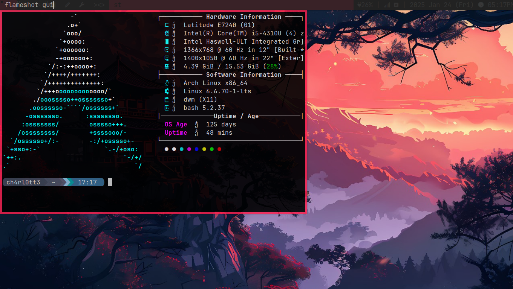
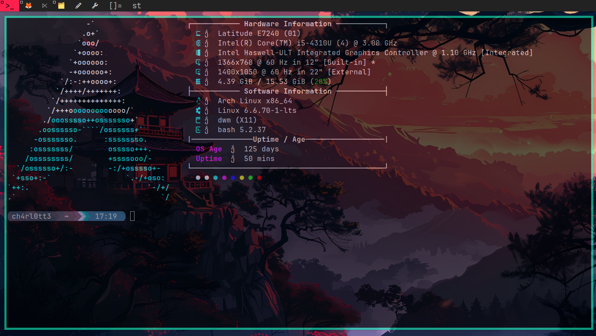

# Arch Linux Backup Repository

Welcome to the **Arch Linux Backup Repository**! This repository contains configurations, scripts, and patches for setting up and customizing a minimalistic and powerful Arch Linux environment. Below is a brief overview of the contents:

---

## 📂 Repository Structure

- **dmenu**: A dynamic menu for X, patched for extended functionality.
- **dwm**: Dynamic Window Manager, customized for efficiency.
- **dwmblocks**: Modular status bar for dwm, with custom scripts.
- **slstatus**: A lightweight status bar for window managers.
- **st**: Simple Terminal, patched for additional features.
- **.xinitrc**: Configuration file for starting X session with dwm.

---

## 📷 Screenshots

### Desktop Overview



---

## 🛠 Installation

### Prerequisites
Ensure the following packages are installed:

```bash
sudo pacman -S base-devel git xorg xorg-xinit
```

### Clone the Repository

```bash
git clone https://github.com/your-username/backup-arch-linux.git
cd backup-arch-linux
```

### Build and Install Components
Each component can be built and installed as follows:

#### Example: `dwm`
```bash
cd dwm
make
sudo make install
```
Repeat for `dmenu`, `st`, `dwmblocks`, and `slstatus`.

### Configure `.xinitrc`

Add the following line to your `.xinitrc`:

```bash
exec dwm
```

Start the session using:

```bash
startx
```

---

## 🔧 Customization

### Patching
Patches for dwm, st, and other components are included in the `patches` directory. Apply them as needed:

```bash
cd dwm
patch < /dwm/patches
```

### Scripts for dwmblocks
Modify and customize the scripts in the `dwmblocks` directory to display system information, such as battery status, volume, and network.

---

## 🌟 Features

- **Minimal and Lightweight**: Optimized for performance.
- **Highly Customizable**: Modify configurations and scripts to suit your workflow.
- **Efficient Workflow**: Designed for power users and developers.

---

## 🙌 Credits

- [suckless.org](https://suckless.org) for the core components.
- Community contributors for patches and ideas.

---

## 📜 License

This repository is licensed under the MIT License. See the [LICENSE](LICENSE) file for details.

---

## 🤝 Contributing

Feel free to fork this repository, make your customizations, and submit a pull request. Contributions are welcome!

---

Enjoy your minimalistic and productive Arch Linux experience! 🎉
